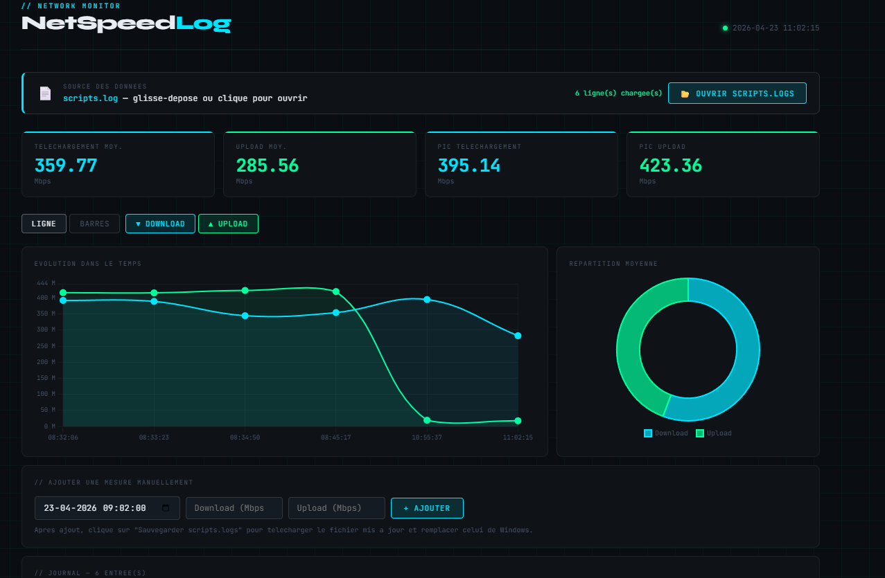

# Windows SpeedTest Dashboard

> Surveillance automatique de votre connexion Internet avec visualisation graphique en temps réel — léger, local, sans dépendances cloud.

---

## Fonctionnalités

- **Tests automatisés** — planifiez des mesures toutes les heures sans intervention manuelle
- **Dashboard web local** — visualisez l'évolution de votre débit via une interface graphique claire
- **Léger et autonome** — fonctionne entièrement en local, sans compte ni service externe
- **Natif Windows** — basé sur PowerShell, aucune installation complexe requise

---

## Aperçu




## 📦 Prérequis

Télécharge et installe **Speedtest CLI** depuis le site officiel d'Ookla :
👉 https://www.speedtest.net/apps/cli

Place l'exécutable `speedtest.exe` dans le dossier du projet dans le répertoir dependance du projets.

---

## Installation

### 1. Télécharger le projet

Clonez le dépôt ou téléchargez l'archive ZIP et décompressez-la dans le dossier de votre choix.


### 2. Autoriser l'exécution des scripts PowerShell

Ouvrez PowerShell **en tant qu'administrateur** et exécutez :

```powershell
Set-ExecutionPolicy Unrestricted
```

> ⚠️ Cette commande autorise l'exécution de scripts locaux. Vous pouvez la restreindre à nouveau quand vous le souhaiter avec `Set-ExecutionPolicy RemoteSigned`.

### 3. Débloquer le script principal

Faites un **clic droit** sur `SPEEDTEST.ps1` → **Propriétés** → cochez **Débloquer** en bas de la fenêtre (si l'option apparaît) → **OK**.

---

##  Automatisation via le Planificateur de tâches

Pour lancer le test automatiquement toutes les heures :

1. Ouvrez le **Planificateur de tâches Windows** (`taskschd.msc`)
2. Créez une nouvelle tâche avec les paramètres suivants :

| Paramètre    | Valeur                                                                 |
|--------------|------------------------------------------------------------------------|
| Déclencheur  | Toutes les heures, répétition indéfinie                               |
| Programme    | `powershell.exe`                                                      |
| Arguments    | `-ExecutionPolicy Bypass -File "C:\chemin\vers\SPEEDTEST.ps1"`        |

---

## Utilisation

Une fois le script en place et planifié, il s'exécute silencieusement en arrière-plan et enregistre les résultats de chaque test. Ouvrez simplement le dashboard web local pour consulter :

- L'historique des débits montants et descendants
- Les pics et creux de connexion dans le temps
- Une vue d'ensemble de la stabilité de votre réseau

---

## Avertissement

L'exécution fréquente de tests de vitesse **consomme de la bande passante** et peut légèrement solliciter votre connexion pendant les mesures. Adaptez la fréquence à vos besoins.

---

## Stack technique

- **PowerShell** — collecte des données de vitesse
- **HTML / CSS / JS** — interface de visualisation locale
- **Speedtest CLI** — moteur de mesure réseau


---

## 📄 Licence

Ce projet est distribué sous licence MIT. Voir le fichier [`LICENSE`](LICENSE) pour plus de détails.

---

<p align="center">
  Fait avec ☕ et l'assistance de l'IA · <a href="https://github.com/PoretQuentin/NETSPEEDLOG-TOOL">GitHub</a>
</p>